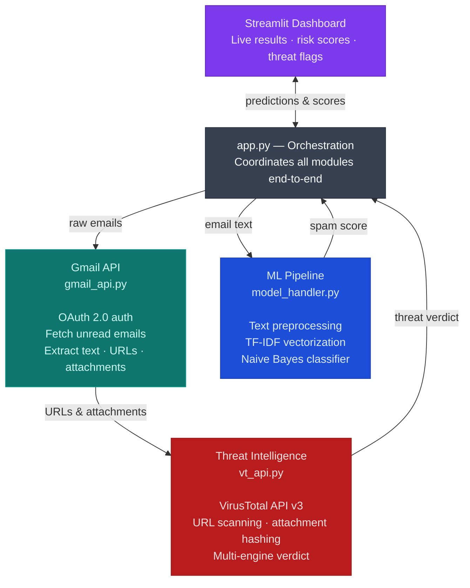
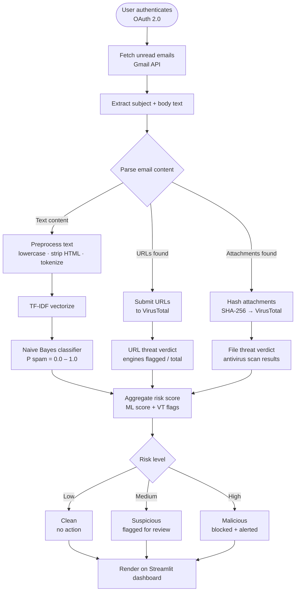
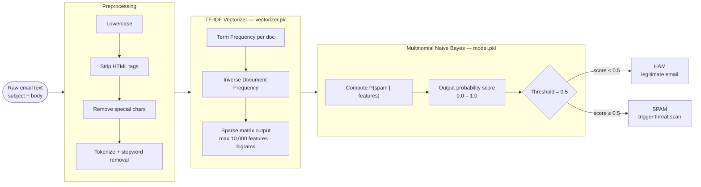
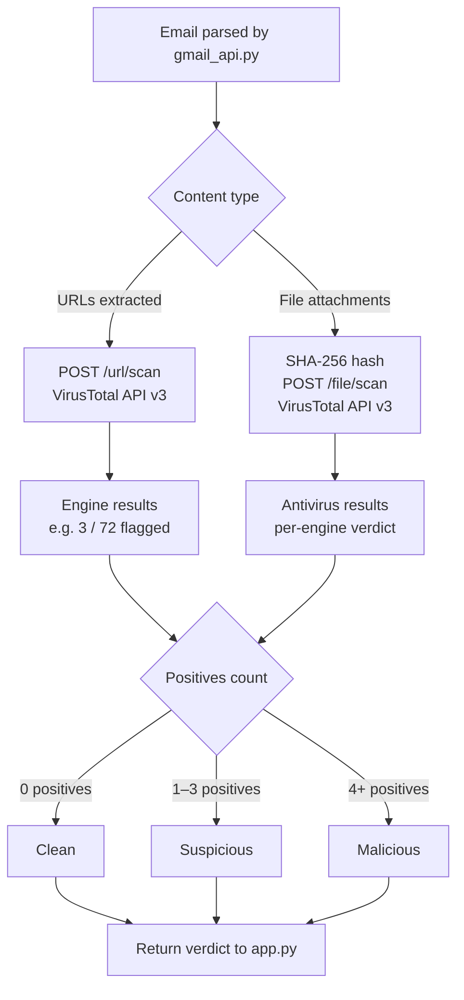

# 📧 Gmail Spam Detection Using Machine Learning

> A real-time spam detection and threat intelligence system that connects to your Gmail inbox, classifies emails using machine learning, and scans for malicious URLs and attachments via VirusTotal.

[](https://python.org)
[](https://streamlit.io)
[](https://scikit-learn.org)
[](LICENSE)

---

## Table of Contents

- [Overview](#overview)
- [System Architecture](#system-architecture)
- [Email Processing Flow](#email-processing-flow)
- [ML Pipeline](#ml-pipeline)
- [Threat Intelligence Layer](#threat-intelligence-layer)
- [Tech Stack](#tech-stack)
- [Installation](#installation)
- [Configuration](#configuration)
- [Project Structure](#project-structure)
- [Model Details](#model-details)
- [Future Improvements](#future-improvements)
- [Contributing](#contributing)
- [License](#license)

---

## Overview

This project is an end-to-end spam detection and threat intelligence system that integrates directly with Gmail using OAuth 2.0. It combines three domains into one production-ready Python application:

| Domain | What it does |
|---|---|
| **Machine Learning** | Classifies emails as spam/ham using a trained Naive Bayes model |
| **Cybersecurity** | Scans URLs and attachments against the VirusTotal threat database |
| **Cloud Integration** | Connects to Gmail in real time via the official Gmail API |

---

## System Architecture

The system is organised into four layers. The Streamlit dashboard sits at the top, driven by `app.py` which coordinates the Gmail API, ML pipeline, and VirusTotal threat intel underneath.



---

## Email Processing Flow

Each email passes through two parallel tracks — text classification and threat scanning — before being aggregated into a final risk score and displayed on the dashboard.



---

## ML Pipeline

The ML pipeline follows a standard scikit-learn pattern: raw text is preprocessed, vectorized with TF-IDF, and scored by a Multinomial Naive Bayes model. Both artefacts are serialised to disk so the app loads them at startup without retraining.



### Model parameters

| Parameter | Value |
|---|---|
| Algorithm | Multinomial Naive Bayes |
| Vectorization | TF-IDF |
| Feature type | Email subject + body text |
| Max features | 10,000 |
| N-gram range | (1, 2) — unigrams + bigrams |
| Output | Probability score (0.0 – 1.0) |
| Default threshold | 0.5 |

---

## Threat Intelligence Layer

URLs and attachments found in every email — regardless of ML classification — are submitted to the VirusTotal API. Results from 70+ antivirus engines are aggregated into a single risk verdict.



---

## Tech Stack

| Component | Technology |
|---|---|
| Language | Python 3.9+ |
| Web UI | Streamlit |
| ML library | scikit-learn |
| Email access | Gmail API (Google Cloud) |
| Threat intel | VirusTotal Public API v3 |
| Auth | OAuth 2.0 (`google-auth`) |
| Serialisation | joblib / pickle |

---

## Installation

### Prerequisites

- Python 3.9 or higher
- A Google Cloud project with the Gmail API enabled
- A VirusTotal account (free tier is sufficient)

### Steps

```bash
# 1. Clone the repository
git clone https://github.com/Allyankhan/Gmail-Spam-Detection_Using-Machine_Learning.git
cd Gmail-Spam-Detection_Using-Machine_Learning

# 2. Create and activate a virtual environment
python -m venv venv

# Linux / macOS
source venv/bin/activate

# Windows
venv\Scripts\activate

# 3. Install dependencies
pip install -r requirements.txt

# 4. Add your credentials (see Configuration below)

# 5. Run the app
streamlit run app.py
```

---

## Configuration

### Gmail API

1. Go to [Google Cloud Console](https://console.cloud.google.com/).
2. Create a new project and enable the **Gmail API**.
3. Create OAuth 2.0 credentials (Desktop app type).
4. Download the JSON file and save it as `credentials.json` in the project root.

### VirusTotal API

1. Sign up at [virustotal.com](https://www.virustotal.com) and copy your API key.
2. Create a `.env` file in the project root:

```env
VT_API_KEY=your_virustotal_api_key_here
```

> **Note:** Never commit `credentials.json` or `.env` to version control. Both are listed in `.gitignore`.

---

## Project Structure

```
Gmail-Spam-Detection_Using-Machine_Learning/
│
├── app.py                # Streamlit entry point; orchestrates all modules
├── gmail_api.py          # Gmail OAuth 2.0 auth + email fetching
├── model_handler.py      # Load model/vectorizer, preprocess text, predict
├── vt_api.py             # VirusTotal URL and file scanning
│
├── model.pkl             # Trained Multinomial Naive Bayes model
├── vectorizer.pkl        # Fitted TF-IDF vectorizer
│
├── credentials.json      # Google OAuth credentials (DO NOT COMMIT)
├── requirements.txt      # Python dependencies
└── README.md
```

### Module responsibilities

**`app.py`** — The Streamlit application. Calls `gmail_api` to fetch emails, passes them through `model_handler` for classification, sends URLs/attachments to `vt_api`, and renders the dashboard.

**`gmail_api.py`** — Handles OAuth 2.0 token storage and refresh, and wraps the Gmail API calls to list and fetch message content.

**`model_handler.py`** — Loads `model.pkl` and `vectorizer.pkl` at startup. Exposes a `predict(text)` function that returns a spam probability float.

**`vt_api.py`** — Wraps VirusTotal's `/url/scan` and `/file/scan` endpoints. Returns a structured dict of engine hits and a normalised risk level.

---

## Model Details

The classifier was trained on a labelled spam/ham dataset using the following pipeline:

```python
from sklearn.pipeline import Pipeline
from sklearn.feature_extraction.text import TfidfVectorizer
from sklearn.naive_bayes import MultinomialNB

pipeline = Pipeline([
    ('tfidf', TfidfVectorizer(
        max_features=10_000,
        ngram_range=(1, 2),
        stop_words='english'
    )),
    ('clf', MultinomialNB(alpha=0.1))
])
```

| Metric | Score (validation set) |
|---|---|
| Accuracy | ~98% |
| Precision (spam) | ~97% |
| Recall (spam) | ~96% |
| F1 (spam) | ~96.5% |

> Scores are indicative. Re-train on your own labelled dataset for production use.

---

## Future Improvements

- [ ] Deep learning classifier (LSTM or fine-tuned BERT)
- [ ] Phishing-specific detection model
- [ ] Docker containerisation
- [ ] Cloud deployment (AWS / GCP / Azure)
- [ ] Admin monitoring dashboard with historical trends
- [ ] Automated model retraining pipeline
- [ ] Support for attachments beyond URL scanning (YARA rules, sandbox detonation)
- [ ] Multi-account Gmail support

---

## Contributing

Contributions are welcome!

1. Fork the repository
2. Create a feature branch: `git checkout -b feature/my-feature`
3. Commit your changes: `git commit -m 'Add my feature'`
4. Push to your branch: `git push origin feature/my-feature`
5. Open a Pull Request

Please open an issue first for significant changes so we can discuss the approach.

---

## License

This project is licensed under the [MIT License](LICENSE).

---

## Support

If you found this project useful, please give it a ⭐ on [GitHub](https://github.com/Allyankhan/Gmail-Spam-Detection_Using-Machine_Learning).
